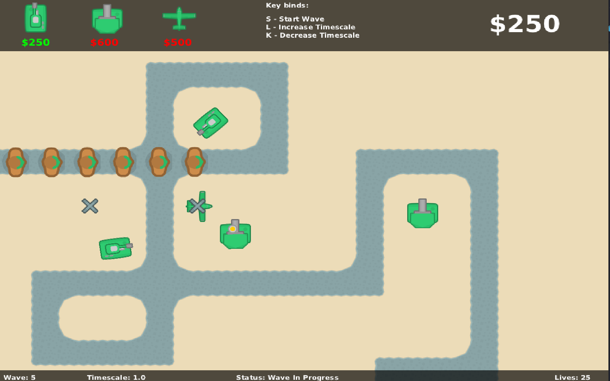
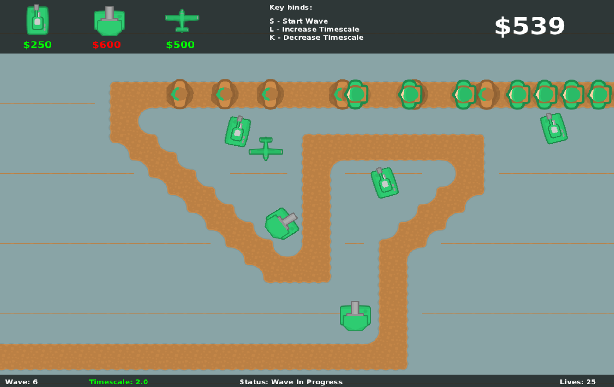

# Shadow Defend Java
Simple tower defense type game based I created using Java and the Bagel GUI library. The purpose behind making this game was to exercise core OOP concepts such as inheritance, polymorphism, encapsulation et. as well as learn advanced Java features such as asyb=nchronous programming, state management, exception handling etc. 

# Demo Gameplay 

To watch the demo gamplay on YouTube, click [this link](https://www.youtube.com/watch?v=u6LZTGjbzhc)

## Here are some in-game screenshots 

# How to play 
1. Clone repository 
2. Open in IntelliJ or any other IDE you use for Java as a project
3. Add bagel.jar file under "lib" folder as project library 
4. Run the ShadowDefend.java file to play the game 
